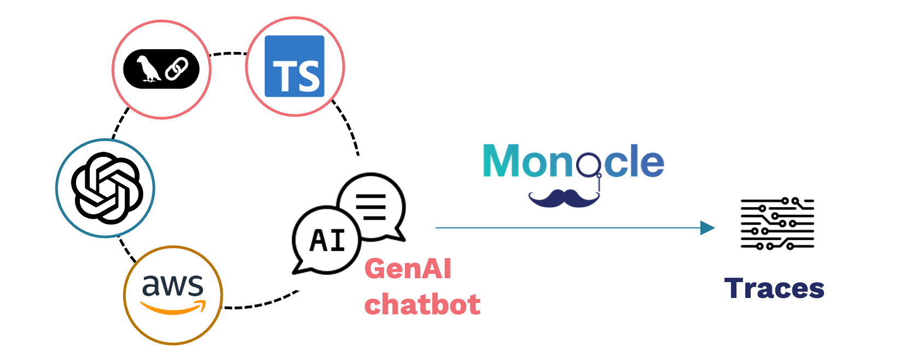

## Demo

 

Checkout the chatbot code on [Github](https://github.com/okahu-demos/chatbot-coffee-lambda) to see how easy it is to instrument your code with Monocle.

## Documentation

- [What is Monocle?](documentation/What-is-monocle.md)
- Use Monocle
  - [Quickstart](documentation/quickstart.md)
  - [User guide](documentation/Monocle_User_Guide.md)
- [Contribute](documentation/Monocle_contributor_guide.md)
- Join [Monocle Slack channel](https://join.slack.com/t/monocle2ai/shared_invite/zt-37pgez3jr-BNjNynF6VV8iHvRlaLM7QA)
